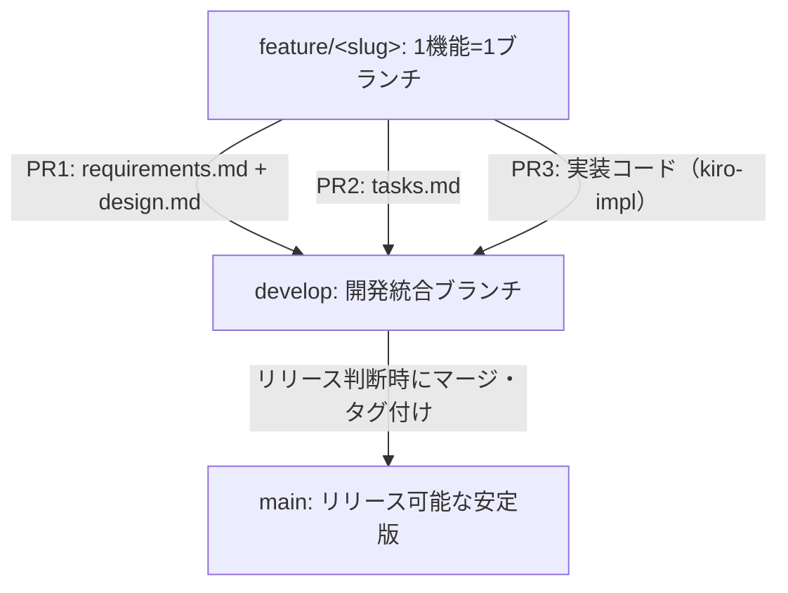

# ブランチ運用ルール

CC-sdd (Kiro形式のspec-driven development) を用いた開発フローと連動するブランチ運用を定義する。

## ディレクトリの役割分担
- [`.kiro/`](../.kiro/): CC-sddツールが読み書きする作業領域（`steering/` / `specs/` / `settings/`）。仕様はコードと同様にGitでバージョン管理する。
- [`docs/`](./): 人間向けの要件サマリ・プロダクト概要・アーキテクチャ・本ドキュメントを管理する。

## ブランチ構成

- **`main`**: リリース可能な状態のみ。直接コミット禁止、`develop`からのマージのみ。
- **`develop`**: 開発統合ブランチ。デフォルトのベースブランチ。
- **`feature/<slug>`**: 機能・タスク単位で作成する唯一の作業ブランチ。`<slug>`は`.kiro/specs/<slug>`と同じ名前にして仕様と実装の対応を明確にする。このブランチ上でCC-sddの一連のフローを実行する。

## `feature/<slug>` ブランチでの進め方

1. **要件・設計フェーズ**
   - `/kiro-discovery` → `/kiro-spec-init <slug>` → `/kiro-spec-requirements <slug>` → `/kiro-spec-design <slug>` を実行し、`.kiro/specs/<slug>/requirements.md`・`design.md`を作成する。
   - `docs/requirements/<slug>.md`に要件サマリ（背景・スコープ・受け入れ条件の要約＋詳細へのリンク）を追加する。
   - **PR1**として`develop`へ提出し、要件・設計をレビュー・承認する。マージ後もブランチは削除せず、`develop`を取り込んで継続する。
2. **タスク分解フェーズ**
   - `/kiro-spec-tasks <slug>`で`tasks.md`を作成する。
   - **PR2**として`develop`へ提出・マージする（小規模な機能ではPR1に含めてよい）。
3. **実装フェーズ**
   - `/kiro-impl <slug>`でタスクごとにTDD（RED→GREEN）で実装する。
   - 完了したら**PR3**（実装コード＋関連する`docs/`更新）を`develop`へ提出・マージする。
   - マージ後、`feature/<slug>`ブランチを削除する。

## リリース
- `develop`の内容が安定したタイミングで`develop`→`main`にマージし、タグ（例: `v0.1.0`）を付与する。
